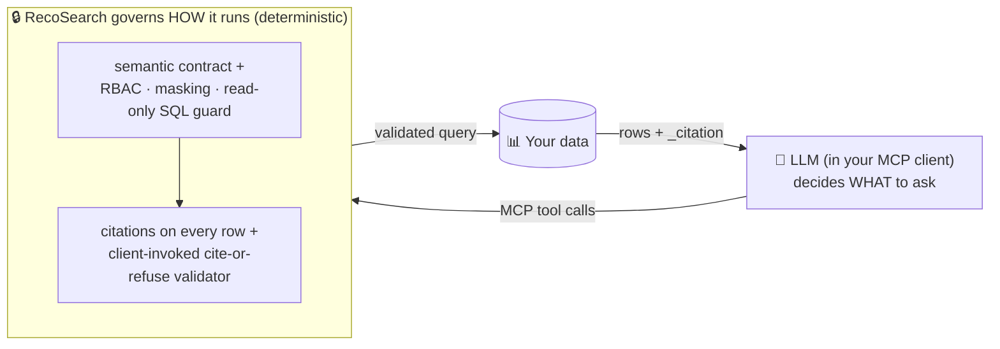

# RecoSearch

> **Let an LLM answer questions over your real data — and prove every number it returns.**

RecoSearch is a **deterministic, governed MCP server**. An MCP client (Claude, Claude Code, any
MCP-compatible app) plans a question; RecoSearch decides whether and how to run it, executes **only
contract-allowed, read-only** queries, and returns either an answer carrying full provenance — every
row cited back to its source and the exact contract version that produced it — or a **typed refusal**.

**It is not an agent.** There is no model-driven decision loop in the server. All reasoning lives in
the external MCP client; RecoSearch only governs execution.

[](LICENSE)




## Two governed paths, one server

RecoSearch exposes two coherent capabilities under one MCP server, one package, and one
cite-or-refuse philosophy:

1. **Governed multi-source query (breadth).** Read-only, contract-governed access across six source
   types — **structured** (DuckDB, Postgres, Snowflake), **text** (OpenSearch), **vector** (Qdrant),
   and **document** (MongoDB) — with RBAC, field masking, a read-only SQL guard, in-process federation
   across sources, and a per-row citation on every result.
2. **Certified semantic layers (depth, DuckDB).** A certified **metric kernel** (definition-hash,
   fan-out guard against double-counting, freshness SLA), an **L2 context/trust** layer, and **L3
   ontology** claim validation. An **experimental** L4/L5 decision + calibration loop is available
   behind a flag (off by default).

> **Honest scope.** The depth semantic layers run on a local DuckDB source. The breadth path is the
> one that spans all six source types. Both share the same contract, envelope, and citation model.

## Every row is citable — and the client enforces it

Every row a data tool returns carries a `_citation` (source, contract version, fields, query hash,
and whether it may back a final answer). RecoSearch also ships `validate_cited_evidence_packet`, a
closure-graph validator that refuses a packet whose claims don't resolve to evidence actually returned
this session from the source that defines the metric, pinned to the current contract.

**The validator is a tool the client calls** — the server provides the validator and the provenance;
the MCP client invokes the gate before presenting an answer. The server does not silently auto-validate
behind your back. See the [worked example](docs/usage/worked-example.md) for the full
question → tool calls → cited answer flow.

## How you author it

Three files you author are the source of truth for the breadth path — **no business logic in Python**:

| File | Role |
|------|------|
| `source_config.yaml` | Connection authority — where each source lives and how to reach it |
| `semantic.md` | Business meaning — metrics, rules, dimensions, measures, relations in plain language |
| `scenario_config.yaml` | Scenario identity and optional governance (RBAC, field masking, vocabulary) |

The depth semantic layers are authored as their own kernel YAML (see
[docs/design](docs/design/) and the bundled `recosearch/semantic_layers/semantic/`).

## Quickstart — zero infrastructure, 2 minutes

The bundled **NovaShop** example is a single DuckDB file (products, customers, orders). No server, no
credentials:

```bash
pip install -e ".[duckdb]"

# Build the sample database (deterministic), point the server at the example, compile + check.
python examples/novashop-duckdb/seed.py
export RECOSEARCH_SEMANTIC_DIR=examples/novashop-duckdb
recosearch --write-semantic-json
recosearch --validate
recosearch --health-check        # → status "ok" with nothing else running

# Start the MCP server (connect it from Claude Desktop / Claude Code)
recosearch
```

Then ask your MCP client *"Which product category drove the most delivered order revenue?"* and watch
it call the governed tools and return a cited answer.

## Install

```bash
pip install -e ".[duckdb]"            # minimal: the zero-infra quickstart
pip install -e ".[all,dev]"           # all adapters + ontology + tests
```

Extras: `duckdb`, `postgres`, `opensearch`, `qdrant`, `snowflake`, `mongodb`, `ontology`,
`observability`. The depth ontology layer needs the `ontology` extra (`rdflib`, `pyshacl`).

## CLI

| Command | Description |
|---------|-------------|
| `recosearch` | Start the MCP server |
| `recosearch --write-semantic-json` | Compile `semantic.json` from the source files |
| `recosearch --validate` | Validate declared inputs; non-zero exit on errors |
| `recosearch --health-check` | Probe all declared sources |
| `recosearch --check-semantic-json` | Verify `semantic.json` is not stale |

## Environment variables

| Variable | Default | Description |
|----------|---------|-------------|
| `RECOSEARCH_SEMANTIC_DIR` | `./semantic` | Directory holding the active scenario's input files |
| `RECOSEARCH_CONTRACT_ENFORCEMENT` | `warn` | `strict` aborts startup on invalid/stale contract |
| `RECOSEARCH_ROLE` | — | RBAC role applied to all requests (`admin`, `analyst`, `viewer`). Opt-in: governance is **off** when unset. |
| `RECOSEARCH_EXPERIMENTAL` | `off` | Enables the experimental L4/L5 decision/calibration tools |
| `RECOSEARCH_TRACING_ENABLED` | `false` | Export MCP tool spans to Phoenix (needs the `observability` extra) |

## Limitations (what v0.1 does and does not do)

- The **depth semantic layers run on DuckDB**; the multi-source breadth path is the one spanning all
  six source types.
- **Federation is an in-process slice-join** over pre-fetched rows, not atomic cross-source SQL.
- **RBAC/masking are opt-in** and default to off (no `RECOSEARCH_ROLE` → no role gating). The read-only
  SQL guard and contract gating are always on.
- The **experimental** decision/calibration tools keep their ledger **per-process** (the audit trail is
  not persisted across restart). They are off by default behind `RECOSEARCH_EXPERIMENTAL`.
- The read-only guard blocks mutating SQL, undeclared tables/columns, no-FROM/constant selects, and a
  denylist of server-side functions (file read/write, sleep, dblink). **Run the DB connection under a
  least-privilege, read-only role as the backstop.**

See [docs/usage/limitations.md](docs/usage/limitations.md) for the full list.

## Documentation

- [Getting started](docs/usage/getting-started.md) · [Worked example](docs/usage/worked-example.md) ·
  [Configuring sources](docs/usage/configuring-sources.md) · [Security](docs/usage/security.md) ·
  [Architecture](docs/design/architecture.md)

## Running tests

```bash
pip install -e ".[duckdb,postgres,mongodb,ontology,dev]"
recosearch --write-semantic-json                                   # compile first
pytest -q tests/unit tests/smoke tests/integration -m "not live"   # breadth gateway
pytest -q tests/semantic_layers -m "not live"           # depth semantic layers
```

## License

Apache-2.0 — see [LICENSE](LICENSE). Built by [Recohut](https://github.com/recohut).
Found a security issue? See [SECURITY.md](SECURITY.md).
