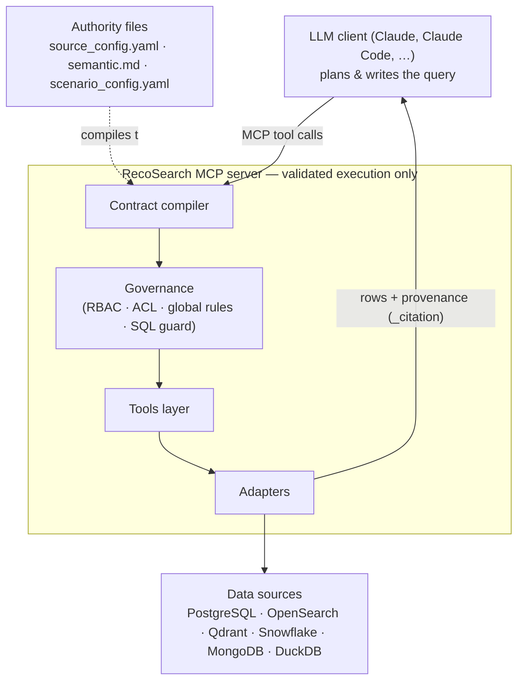

# Architecture

## Overview

RecoSearch is a governed MCP server. It sits between an LLM client and your data sources, enforcing a declared semantic contract on every query. The LLM does all reasoning and query planning; the server does only validated execution.



## Authority files

The server has exactly three inputs. Nothing about data meaning or connection details lives anywhere else.

**`semantic/source_config.yaml`** — Connection authority. Declares every source the server is allowed to reach: host, port, database, collection, index. Secrets are injected at runtime via `${ENV_VAR}` references and never committed.

**`semantic/semantic.md`** — Business meaning authority. Written in plain language by a business owner, not an engineer. Defines metrics (how to compute them), rules (what is always true), dimensions (queryable fields), measures (aggregatable fields), and relations (cross-source joins). The compiler reads this and produces a structured contract.

**`semantic/scenario_config.yaml`** — Scenario identity and governance. Holds the scenario ID, MCP server name, and optional blocks for RBAC (which roles can call which tools), field-level ACL (which fields are masked for which roles), and vocabulary extensions.

## Contract compilation

At startup the server compiles the three authority files into an in-memory semantic contract (`semantic.json`). The contract is the only thing the tool layer consults at query time — it never re-reads the source files during a request.

Compilation runs the global-rule compiler (parses `semantic.md` rules into structured predicates), resolves source declarations against `source_config.yaml`, and validates the result. Any error-severity issue is surfaced on startup.

`semantic.json` is a derived artifact. Regenerate it with:

```bash
recosearch --write-semantic-json
```

## Governance layer

Every inbound tool call passes through two checks before reaching an adapter:

1. **RBAC** — The caller's role (from `RECOSEARCH_ROLE`) is checked against the `roles` block in `scenario_config.yaml`. If the tool is not in the role's allowed list the call is rejected.

2. **ACL / field masking** — Fields listed in `access.sensitive_fields` are masked in all results for any role not in `access.unmasked_roles`. Masking happens after data is returned from the adapter, before the result is sent to the client.

Both blocks are optional. Omitting `roles` opens all tools to all callers. Omitting `access` disables masking.

## Adapter plugin framework

Each data source type has a dedicated adapter module in `recosearch/adapters/`. A module declares a single `ADAPTER = SourceAdapter(...)` — a frozen dataclass (see `adapters/base.py`) with:

- `source_type` — e.g. `"postgres"`, `"duckdb"`
- `capabilities` — a frozenset of storage capabilities (`structured_query`, `text_search`, `vector_search`, `document_query`)
- `run_query` — the capability executor (the only execution entry point)
- `sql_dialect` — sqlglot dialect for SQL sources (else `None`)
- `health_check` — optional connectivity probe
- `available` — capabilities are advertised only when `True` (gate on driver presence)
- `config_schema` — the per-adapter connection-key schema

`adapters/__init__.py` auto-discovers every module that defines an `ADAPTER` and keys it by `source_type`; dropping in a new `<type>.py` registers it with no other edits. Driver imports are lazy, so the package imports even when an optional driver is absent. Routing is capability-based, so a new structured source (like DuckDB) inherits the SQL guard, metrics, and global rules for free. Source types not declared in any adapter are rejected at contract validation time.

## Evidence and citations

Every adapter call returns an evidence envelope: a structured record containing the source ID, the query that was run (SQL, vector query, text query, etc.), a hash of that query, the fields returned, and the actual rows. The tool layer assembles these envelopes into a cited-evidence packet before returning to the LLM.

The LLM must cite this packet in any final answer. `validate_cited_evidence_packet` checks that every claim in the packet has a corresponding evidence envelope with matching source, fields, and query hash. Answers without full citation are rejected.

## Enforcement modes

`RECOSEARCH_CONTRACT_ENFORCEMENT` controls startup behaviour:

- `warn` (default) — logs issues and starts anyway; governed tools refuse on an invalid contract
- `strict` — aborts startup on any error-severity issue or stale `semantic.json`

Use `strict` in CI and production deployments.
